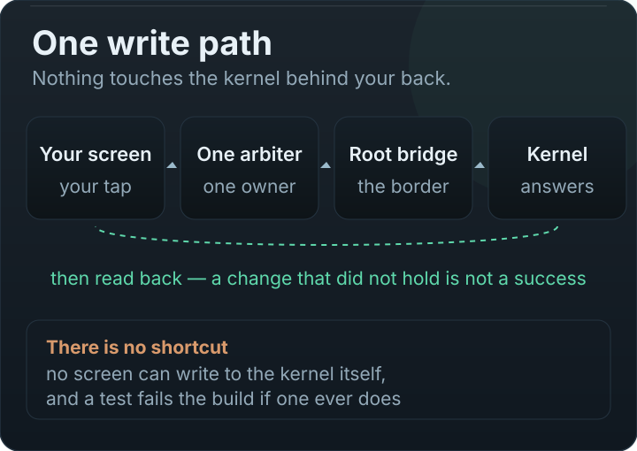

# Architecture

MaxManager is a polyglot system: one Compose application as the control surface, five native executables
that do the persistent work on the device, and a Rust library behind a JNI seam for the operations
where a shell round-trip per question was the wrong shape.

<p align="center"></p>

## The four invariants

These are architectural, not stylistic — each is enforced by a test or a gate, not by convention.

| Invariant | Enforced by |
| --- | --- |
| **One write path.** Every hardware mutation goes through `HardwareControlArbiter`; nothing else writes. | `core/hardware/ControlPlaneArchitectureTest.kt`, plus the §6 gate that fails the build on a sysfs write inside `ui/**` |
| **Capability before control.** Nothing is surfaced until the platform proves the interface exists. | `HardwareCapabilityResolver` + the Atlas capability map |
| **One navigation spine.** Routes exist in `ui/navigation/MaxDestinations.kt` and nowhere else. | A static test that fails on a literal route string outside that package |
| **One design language.** New UI is built from `ui/design/`, not improvised per screen. | `tools/design_tokens.py --assert`, which fails on new hardcoded literals in `ui/**` and names the file |

## Layers

```
┌─ ui/           53 destinations · 9 domains · design system · light/dark · 84 locales
├─ ui/viewmodel/ screen state and root-command orchestration (StateFlow) — never writes hardware
├─ core/hardware/ THE ARBITER · capability resolver · ownership · manual locks · per-app registry
│                 drift guard · read-back verification · repair executor · backends (CPU/GPU/ZRAM/charging)
├─ core/atlas/    discovery · capability map · route planner · adapters · route memory · safety policy
├─ core/maxai/    objective · planner · safety · learning · journal · insights · cadence
├─ core/jni/      6 bridges (probe · prop · scan · archive · context · predictor) → libmaxmanager_native.so
├─ core/platform/ app_status protocol · property reads (native first) · FPS · sensors · thermal reads
└─ core/privilege/ privilege levels: root + Shizuku, combined into one declared verdict
```

### The single write path

<p align="center"></p>


```
ui/** → ViewModel → HardwareControlArbiter → RootFileAccess → kernel interface
                        │
                        ├─ journal the intent
                        ├─ resolve ownership (safety > per-app > manual > AI)
                        ├─ write, then read back
                        ├─ compare applied vs actual; attempt rollback on mismatch
                        └─ DriftGuard re-checks later for silent drift
```

`RootFileAccess` is the only root boundary. Reads have a layered path (native reader → IPC → file →
shell) precisely so that the fallback is explicit and not an accident.

### Native layer

| Piece | Language | What it is |
| --- | --- | --- |
| `sys.maxmanager-service` | C (14 components) | The main daemon: app loading, game preload, PID tracking, bypass charging, system profile, inotify, config, logging, startup |
| `sys.maxmanager-rianixiathermalcore` | Rust | Thermal policy daemon (see [thermal.md](thermal.md)) |
| `sys.maxmanager-profilesettings` | Rust | Chipset profiles (see [profiles.md](profiles.md)) |
| `sys.maxmanager-utilityconf` | Rust | Utility configuration |
| `sys.maxmanager-preloadbin` | C | Game library preloader (embeds vmtouch) |
| `libmaxmanager_native.so` | Rust | The JNI library: batched reads (`probe`), property reads without a shell (`sysprop`), storage scan, archive/zip, contextual engine, RL agent, digital twin, power predictor, log parsing |

The JNI packets have a **published wire format** in both languages (`ProbePacket`, `PropPacket`,
`ScanPacket`, `ArchivePacket` and their Rust twins), and `tools/jni_symbols.py --assert` checks the
contract: Kotlin/Java declarations against the Rust symbols in the built libraries, per ABI.

### Cross-process ownership

The app and the daemons can both hold a view of the same physical knob, so ownership lives outside the
process (`SharedHardwareOwnershipStore`) with durable manual locks (`ManualControlLocks`). "Who owns
this control right now?" has one answer that survives a process restart, which is what makes a manual
choice stick.

## Measurement as architecture

Two habits are load-bearing here, not decoration:

1. **Nothing claims a result without reading it back.** `WriteVerification` and `VerifiedControl` exist
   because "we wrote it" and "it settled" are different statements.
2. **Diagnosis is data, not prose.** `DiagnosticCenter` keeps live problems; `LogCodeGlossary` writes
   the meaning of every field **inside the log file itself**; `DeviceBlueprint` makes a report
   reproducible; `HardwareRouteHealth` explains why a control cannot be activated from facts alone.

## What is hard about this design, honestly

- **Cross-process state is genuinely hard.** Ownership, drift and recovery all have a shared store
  behind them, and getting it wrong shows up as "my setting reverted" three screens later.
- **Vendor divergence is the rule.** Frequency units, OPP tables, and property names differ between
  chipsets; the adapters exist because a single code path cannot cover them.
- **The safety list is a judgement.** Fragment matching fails closed (it will refuse something safe
  rather than allow something dangerous) — that is a deliberate trade, not an oversight.
