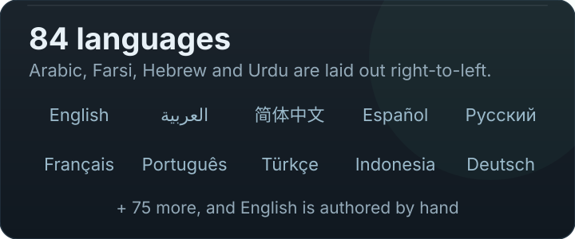

# Features

MaxManager's surface is 60 screens across ten control domains, plus a small set of tools. This page
explains what each part is *for* — not just that it exists.

A rule that shapes everything below: **a control that your device does not expose is not shown as a
switch that does nothing.** If MaxManager cannot read or write an interface, the screen says so and
explains which of the seven capability states applies ([Max Atlas](max-atlas.md)).

---

## Control domains

### CPU — *"Cores, governor, vendor boost and kernel preferences"*

| Screen | What it gives you |
| --- | --- |
| **Cores grid** | Every cluster and core with its live frequency, and the ability to pin a floor or a ceiling per cluster. Cluster names are read from the platform, not guessed. |
| **Governors** | The available governors per policy with the ability to select one. Choices are validated against what the kernel actually advertises. |
| **Property tweaks** | Reviewer-managed system properties that affect scheduling and power, applied in a form you can read before and after. |

### GPU — *"GPU frequencies and graphics-specific vendor parameters"*

**GPU Reality Studio** discovers the driver's advertised frequency table, its unit (Hz vs MHz is a real
mismatch between vendors), the writable controls, and a restoration baseline — then presents only what
it could verify. On MediaTek devices the OPP table is read as a whole table rather than a first-match,
because the first match can be a runtime-narrowed view.

### Memory — *"Compression, VM behaviour and swappiness"*

**ZRAM manager** covers the compression device: size, algorithm, and the VM parameters around it. The
engine also reads **memory stall pressure** (`/proc/pressure/memory`) rather than fill percentage,
because a nearly-full-but-idle device and a stalling device need opposite responses.

### Display — *"Refresh rate, colour and canvas scale"*

**Display studio** and **Resolution** (including per-app downscaling) — always validated against what the
platform advertises, with the current mode readable.

### Responsiveness — *"Touch, frame pacing and scheduling latency"*

Touch boost, **FPS GO** (frame-rate governance), and **FAS** (frame-aware scheduling). The **FPS
overlay** — a live HUD over other apps — lives with the tools rather than here, because it is something
you look at, not something you tune.

### Thermal — *"Temperatures, throttling and thermal parameters"*

Live zone temperatures, the throttling picture, and the parameters that govern it. The `thermalcore`
daemon (see [thermal.md](thermal.md)) is the part that acts: it learns how this device responds, and
predicts. **Thermal trip points are on the never-touch list** — they are the hardware's own protection,
and no profile may override them.

### Power — *"Charging, bypass, sleep and battery health"*

Charging and battery health in one screen, **bypass charging** (running from the cable without pushing
current through the pack) with a dedicated **status check**, and **Doze**.

### Storage & compiler — *"Compilation mode and storage health"*

**Dex2oat** compilation mode and storage health. Storage scanning is done in the native layer in
batches, not by shelling out per directory.

### Network — *"Traffic scheduling and link state"*

Network detail (what the link is doing right now) and the scheduler controls.

### Audio — *"Output devices, streams and declared effects"*

Read-only today, and deliberately so: the hub reports what the platform declares for the primary
output (sample rate, frames per buffer), every endpoint the device announces — outputs first, then
inputs — and the effects the audio engine reports. An empty list is a reading (*"no effects"* — the
device announced none), while an unreadable one is reported as unreadable rather than as zero.

---

## Apps

| Screen | What it gives you |
| --- | --- |
| **Apps** | Everything installed, searchable, with per-app policy entry points. |
| **App settings** (per app) | Per-app performance, refresh rate and resolution, thermal ceiling, and its own quick actions — the same knobs as the global screens, scoped to one package. |
| **Debloat & freeze** | Disable or freeze apps you do not want running, reversibly. |

Per-app work is tracked per knob, with a recovery store, so a session that ends badly does not leave a
package in an unexplained state.

---

## Tools

| Tool | What it gives you |
| --- | --- |
| **Process manager** | What is running, what it costs, and what can be stopped. |
| **FPS overlay** | A live frame-rate and load HUD drawn over other apps. |
| **Log viewer** | The device log, parsed into events with a **glossary written into the log file itself** — the file explains its own fields. |
| **Max Backup** | Back up apps and check their integrity; restore when you need to. |
| **Permissions** | Declared permissions vs what the platform actually allows (`AppOps`), in one place, because "declared" and "granted" differ. |
| **SetEdit** | Direct access to the settings database for values with no UI. |
| **Activity Launcher** | Launch exported and internal activities. |
| **File manager** | A file browser for the paths this kind of work touches, with bookmarks and history. |
| **Backup & restore** | Save your MaxManager configuration to a file, and restore it. Tweaks require the same chipset; per-app settings restore anywhere. |
| **Config backup** | The file-level half of the same idea, written where you choose. |

---

## The intelligence layer

| System | What it does for you | Read more |
| --- | --- | --- |
| **Max Atlas** | Makes every feature work on *your* device — discovering which interfaces exist, which routes reach them, and remembering what actually succeeded | [max-atlas.md](max-atlas.md) |
| **Max AI** | Decides what should change now: an objective, the smallest sufficient intervention, safety first, and a real measurement before any reward | [max-ai.md](max-ai.md) |

Both are **off by default**. Nothing self-enables, and no control moves without either your action or an
engine you switched on.

---

## Diagnostics and support

| Feature | What it gives you |
| --- | --- |
| **Diagnostic centre** | Live memory of what is wrong right now, instead of making you read log files. |
| **Route health** | For any control: *why* it can or cannot be activated on this device, from facts. |
| **Device blueprint** | A read-only snapshot included in every diagnostic export, so a report can be reproduced. |
| **Support report** | A minimized artifact you choose to send at the end of the safe stages — not a screenshot. |
| **Atlas doctor** | Replays a recorded device and checks the report reproduces (the maintainer's loop). |

---

## Interface and language

- **Light and dark**, with a themable key colour and a custom palette screen.
- **84 locales** plus English; the picker follows the system language without a restart.
- **RTL is enforced** by a gate, not by hope — Arabic, Farsi, Hebrew and Urdu ship.
- A **design system** (`ui/design/`) rather than per-screen improvisation, which is why the screens
  share one rhythm and one set of tokens.
