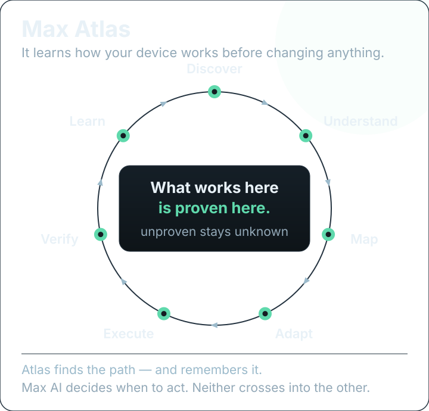

# Max Atlas — making a feature work on *this* device

Atlas exists because "it works on my phone" is not a specification. Android devices present the same
*sounding* interfaces with different names, different units, different writability, and different
levels of honesty. Atlas is the system that finds out which of those is true here — and remembers it.

## The cycle

| Stage | The question it answers | Owner in the code |
| --- | --- | --- |
| **Discover** | What does this device actually expose? | `AtlasDiscovery` + `AtlasBackendProvider` |
| **Understand** | What do the numbers *mean* — identity and units? | `AtlasDeviceIdentity` + `AtlasModels` |
| **Map** | What may we do here, and what must we never touch? | `AtlasCapabilityMap` + `AtlasSafetyPolicy` |
| **Adapt** | How is this particular feature reached on this device? | `AtlasAdapterRegistry` + `AtlasControlAdapter` |
| **Execute** | Make the change — through the one write path | `AtlasAdaptiveExecutor` → `HardwareRepairExecutor` → the arbiter |
| **Verify** | Did it actually settle? | `HardwareVerification` + the confirmation window |
| **Learn** | What does this device remember? | `AtlasRouteMemory` + `AtlasEvidenceStore` |

## Five design rules that produced the whole system

**1. Discovery is bounded, and a limit is reported as a limit.** A scan runs under a budget —
operations, entries, bytes, time (`AtlasReadBudget`). When a bound stops a scan, the report says *a
limit stopped it*, never "the device had nothing to say". That distinction is the difference between a
diagnostic and a guess.

**2. Absence must be proved.** A failed read is not an absence. Only a *successful listing* that does
not contain a name proves that the name is not there — everything else stays `UNKNOWN`
(`AtlasDiscovery.childrenOf`). This is why the app can tell you "your device does not have this" with a
straight face: something had to prove it.

**3. Unknown stays unknown.** The capability map is a *derivation*, never a measurement — every input
comes from something that already established it. `UNKNOWN` is the honest default, and it is
deliberately not `UNAVAILABLE`.

**4. Safety is a separate, higher answer.** `AtlasSafetyPolicy` owns the reviewed never-touch list.
Matching is by *fragment*, on purpose, because vendors add members (`trip_point_14_hyst`,
`watchdog_thresh`) that a narrow list would let through: a false refusal costs one skipped knob and
names its rule; a false allowance costs the hardware protection it was meant to keep. Every rule
carries its reason, because "never write this" without a "because" is a superstition the next
maintainer deletes.

**5. Only a verified write is a success.** `SUPPORTED` requires that a write was read back and stayed
put through the confirmation window. Sending a command is not success; "it was written" is not "it
settled". Everything else is recorded in its real state — `FAILED_ROLLED_BACK`,
`DRIFTED_ROLLED_BACK`, `STATE_UNKNOWN`, `BLOCKED` — and never filed as a vague "failed".

## The seven capability states

| State | Means | Evidence behind it |
| --- | --- | --- |
| `SUPPORTED` | A reviewed route exists **and** a write was verified on this device | planner eligible + remembered verified outcome |
| `WRITABLE` | A reviewed route is eligible now; success not yet proven | planner eligible |
| `READ_ONLY` | The device answers reads; no write route is eligible | measured + readable |
| `NEEDS_ADAPTER` | The feature is visible; this build has no proven way to drive it | readable + no known route |
| `UNAVAILABLE` | Absence was **proved** by a listing | absence proved |
| `NEVER_TOUCH` | A reviewed rule forbids writing this interface | `AtlasSafetyPolicy` |
| `UNKNOWN` | Nothing measured, or nothing answered and absence was never proved | the honest default |

## Where the knowledge comes from

- **`AtlasCatalog`** — *reviewed* capability knowledge: for each interface, an anchor directory, an
  attribute name inside it, the unit, and how it is transported. This is the first line: knowledge we
  stand behind.
- **`AtlasCommunityBank`** — the second line of defense: a *candidate* catalog built from the interface
  vocabulary that open-source kernel-manager projects accumulated over years. Candidates are
  suggestions for a route, never permissions to use one.
- **`AtlasEvidenceStore`** — where cached evidence lives (app-private, atomic replace, bounded read).
- **`AtlasFreshness`** — evidence lifetime, which handles two different meanings of "old" that are
  usually conflated.
- **`AtlasFailureLedger`** — negative evidence with its own lifetime: a read that failed is a fact, and
  some failures are permanent for the process or the boot while others deserve a retry.
- **`AtlasRouteMemory`** — per-device route outcomes: what worked here, and what did not.

## Proving it without a device

Atlas carries its own evidence pipeline: **`AtlasFixtureRecorder`** turns one real run into a *fixture*,
and **`AtlasFixture`** replays that recording through the very same read interface. **`AtlasDoctor`**
then asks whether a replayed device still reproduces the report it came from.

That is how "needs device" stopped being a permanent excuse in this project — and why the discovery
logic has tests that run anywhere.

## Exporting the truth

`AtlasSupportReport` is a **minimized** report a user may choose to send, after the safe stages have
finished; `AtlasReportExporter` writes it to a file you hand over yourself. Nothing is uploaded on its
own. `DeviceBlueprint` is the read-only snapshot that makes a report reproducible, and
`HardwareRouteHealth` answers the *why* — for any control, from facts only — which is what the app
shows when it tells you a switch cannot be activated here.

## The boundary with Max AI — a contract, not advice

| Engine | Its question | It owns | It does not own |
| --- | --- | --- | --- |
| **Max Atlas** | *How can I work on this device?* | which interfaces exist, which route reaches them, whether a write settled, what this device remembers | any performance goal, any priority, any "when" |
| **Max AI** | *What should change now?* | the objective, the value each knob should hold, when to act and when to leave the device alone | route selection, node discovery, direct writes |

Max AI says *"I want the CPU ceiling at 60%"*; Atlas answers *"on this device that is written through
`cpu_limits:<policy>` with a clamped range, verified by read-back, and if it does not hold, no success
is recorded."* Neither crosses the line — Atlas does not tune, and Max AI does not discover hardware.
