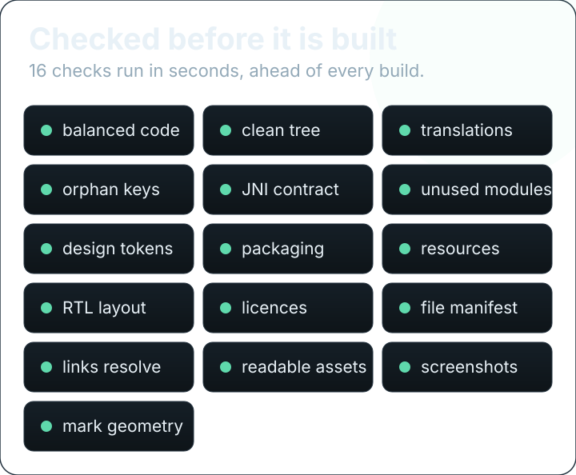

# Verification — how the claims on this page are made

Every number in this repository is supposed to be re-derivable by someone who does not trust the author.
This page is the map of how that works, what can be checked **right here, right now**, and — the part
that matters most — what cannot.

## The three layers

| Layer | Runs where | Needs | Answers |
| --- | --- | --- | --- |
| **Contract gates** | any machine with Python 3 | nothing else | Is the tree internally consistent? |
| **Host tests** | any machine with a C compiler and/or cargo | no SDK, no NDK, no phone | Do the pieces agree on their shared formats? |
| **Device checks** | a real phone | root, and a device | Does it actually behave? — **listed honestly below as unverified here** |

## Layer 1 — contract gates

<p align="center"></p>


Thirty-three judgements run in CI **before** the NDK, Rust and R8 steps, so a broken tree fails in
seconds instead of after minutes of native compilation. Sixteen are assertions; seventeen are the tools
measuring *themselves*.

| Gate | What it refuses to let through |
| --- | --- |
| `kt_balance --assert` | Unbalanced braces, unterminated strings or comments, malformed XML |
| `code_health --assert` | Cleanliness violations, debt above its declared ceiling, undisclosed assets |
| `i18n_coverage --assert` | Wrong format specifiers, duplicate keys, folder/picker/`locales_config` drift |
| `i18n_coverage --prune all --assert` | Orphan translation keys (read-only: it reports, it never deletes) |
| `jni_symbols --assert` | Kotlin/Java ↔ Rust JNI signatures drifting apart (`ADR-48`) |
| `dead_modules --assert` | Rust/C modules that are built but have no user |
| `design_tokens --assert` | New hardcoded literals in `ui/**`, naming the file that added them |
| `bundle_contract --assert` | The 14 packaging contracts: version trio, daemon path, extraction completeness |
| `resource_compile --assert` | Invalid resources, judged by **real aapt2** |
| `rtl_guard --assert` | Directional padding and icons that do not mirror |
| `license_audit --assert` | GPL code appearing anywhere in the release path |
| `source_manifest --assert` | The tree drifting from its declared file digest |
| `readme_assets --assert` | Broken or unsafe assets and links in this documentation, and the contextual icons: art outside the safe area of its grid, a glyph that leans on a font, an icon that appears on one language page only |
| `svg_review --assert` | Visual assets with text too small to read at phone width, panels clipped by the canvas, or a layout that is only right while motion runs |
| `screenshot_gallery --assert` | A screenshot grid on the front page that drifted from the folder it is generated from, a caption longer than its column, a route no screen answers to, or a PNG that is truncated, wrongly proportioned or over its size ceiling |

The four cheapest to run yourself — no SDK, no compiler, no device:

```sh
python3 tools/kt_balance.py --assert
python3 tools/code_health.py --assert
python3 tools/i18n_coverage.py --assert
python3 tools/readme_assets.py --assert
```

**Why the self-tests matter.** A checker that cannot fail proves nothing, so each tool is deliberately
broken and must name the rule it was supposed to catch. `readme_assets --self-test`, for example, feeds
its own SVG checker an illegal `--` inside an XML comment, a stripped `<script>`, a `keyTimes` that
never reaches 1, and a stale banner number — and fails unless each is reported. `svg_review --self-test`
runs sixteen known-outcome cases, including the negative ones: an 8px label must be flagged, a clipped
tile must be flagged, and a glow that bleeds off the edge on purpose must **not** be.
`screenshot_gallery --self-test` runs thirty-five, including a truncated PNG, a file that is not an
image at all, a frame at the wrong ratio, and a grid someone edited by hand. And the negative case is
stated too: **no capture existing yet is not a failure** — the gallery reports the frames as pending,
because a gate that fails on missing coverage would be turned off within a week.

## Layer 2 — host tests, no device

| Suite | What it pins |
| --- | --- |
| `archdaemon/tests/` | The C daemon's shared formats and CLI decisions, driven by the TSV/TXT fixtures |
| `fixtures/contracts/` | **The contract itself**: 15 files measured from both sides — Kotlin produces some, C or Rust reads them, and vice versa (plus the index that explains each row) |
| `cargo test` in `binutils/`, `binprofiles/`, `thermalcore/` | CLI decision tables, the property surface, and the PID decision core |
| `tools/test_atlas_jvm.py` · `tools/test_maxai_jvm.py` | The JVM-side shims for Atlas and Max AI |

`fixtures/contracts/` is the answer to a real class of bug: a format that exists in Kotlin and is read in
C has no compiler watching it, so it breaks silently. Here the format **is data**, in one file, read by
both implementations — so a rename on one side fails the other side's test.

## Layer 3 — what needs a device, stated as needing a device

This is the part other projects round off. These are **not** verified by anything in this repository:

| Not verified here | Why | What would verify it |
| --- | --- | --- |
| Actual hardware behaviour (a write settling on your chipset) | Needs the physical device; units and OPP tables vary by vendor | A run on the device — the app reports it per control, per device |
| SELinux policy correctness | There is no AOSP tree in this environment to run `neverallow` against | Your tree's `neverallow` pass, then `dmesg \| grep -i avc` after boot |
| Boot behaviour and the anti-bootloop guard | Needs a device that boots | The installer's own boot counter, read from `module.prop` |
| Visual output: RTL mirroring on screen, motion, theme | Needs a renderer and a screen | The screenshots in [`screenshots/`](screenshots/README.md) |
| A **signed** release artifact | The signing password is not in this repository, by design | A CI run with the keystore secret present |

Where a claim cannot be verified here, it is written as **"not verified in this environment"** rather
than as a pass. That sentence is a rule in this project, not a hedge.

## What *is* proven about the build itself

- The Android app has been compiled from this tree and its **release-variant unit tests** have run
  green on CI, alongside R8/ProGuard on the release path.
- [`mainfiles/customize.sh`](../mainfiles/customize.sh) is checked against the artifact: the daemon
  arrives as an executable for the right ABI, and the module's checksums verify after extraction.
- The published artifact **is** the flashable zip — no wrapper archive around it.

## Provenance and licensing

Three documents carry this, and they are measurements rather than statements:

| Document | What it records |
| --- | --- |
| [`PROVENANCE.md`](PROVENANCE.md) | `FILE · ORIGIN · LICENSE · STATUS · ACTION` for every third-party-derived file |
| [`AUTHENTICITY.md`](AUTHENTICITY.md) | A similarity measurement against the GPL sources that were removed — generated by `tools/upstream_similarity.py`, not written by hand |
| [`THIRD_PARTY_NOTICES.md`](../THIRD_PARTY_NOTICES.md) | The components that do ship (Apache-2.0, BSD-3-Clause) with their notices |

`license_audit.py --assert` fails the run if GPL code reaches the release path. That gate is why the
attribution sections are specific about which file is a copy and which is an independent
reimplementation.

## Known issues

The project keeps its own defect list — measured entries, not a wishlist — in
[`KNOWN_ISSUES.md`](ai/KNOWN_ISSUES.md), and the delivery log with its failures and rejected tries in
[`HANDOFF.md`](ai/HANDOFF.md). Both are part of why the engineering record is public.
